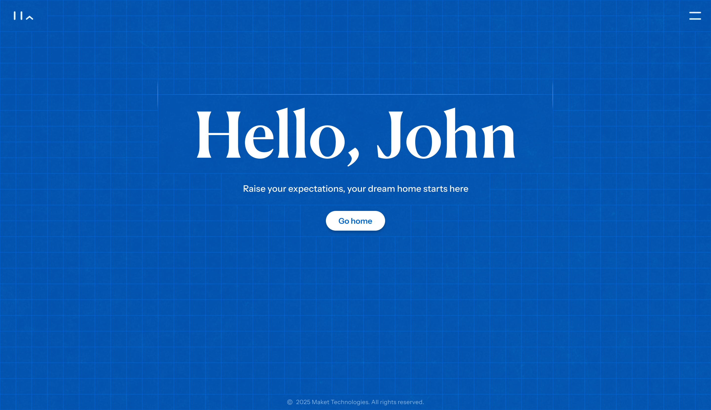

# Maket Frontend - Take Home Assignment

This is a boilerplate repository for take-home assignments for the Frontend Engineer role.

## Getting Started

```bash
git clone <repository-url>
cd react-tanstack-boilerplate
npm install
npm run dev
```

## Assignment Task

Your task is to complete the **root page** (`/`) of this application with the following requirements:

### 1. Root Page Implementation


- Implement the landing page at the root route (`/`) with this [Figma Design](https://www.figma.com/design/qLZRhBinAGwGGTkPFXO0dG/Maket-Take-Home?node-id=1-236&m=dev). The code for this route should be added to the `index.lazy.tsx` file. 
- The main aspect of implementing this design is the grid behind the screen and the elements being placed in specific positions, while being reasonably responsive when resizing the window horizontally and vertically. However, you do not need to make it mobile friendly.
- Feel free to use any combination of TailwindCSS, CSS, and JavaScript for implementing the screen.
- Most of the fonts and colours you will need are already set up in the `index.css` file using TailwindCSS, but feel free to add more colours or use them inline.
- Any required assets can be downloaded from the provided Figma document.
- The "Go home" button in this screen will navigate to the `/cards` page using TanStack router. The `/cards` page is already implemented and ready to use.

### 2. Page Transition Animations
Implement smooth page transition animations for when navigating from the `/` page you developed above to the `/cards` page.

#### Animation Requirements:
- The page transition animation must involve **at least 4 distinct elements** from the screen
- Elements should animate in a coordinated, visually appealing manner
- Consider animating elements like headers, buttons, cards, backgrounds, etc.
- Use native CSS animations, or a library if you prefer (Framer Motion, React Spring, etc.)

### 3. Technical Requirements
- Use TanStack Router for navigation
- Ensure animations are smooth and performant
- Code should be clean, well-organized, and production-ready
- Follow good coding practices

## Evaluation Criteria
- Implementation of the root page with proper navigation and the proper Figma design
- Quality and smoothness of page transition animation
- Creative use of at least 4 animated elements
- Code organization, code architecture, and best practices
